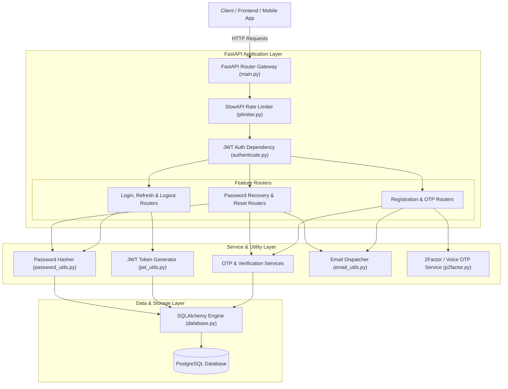
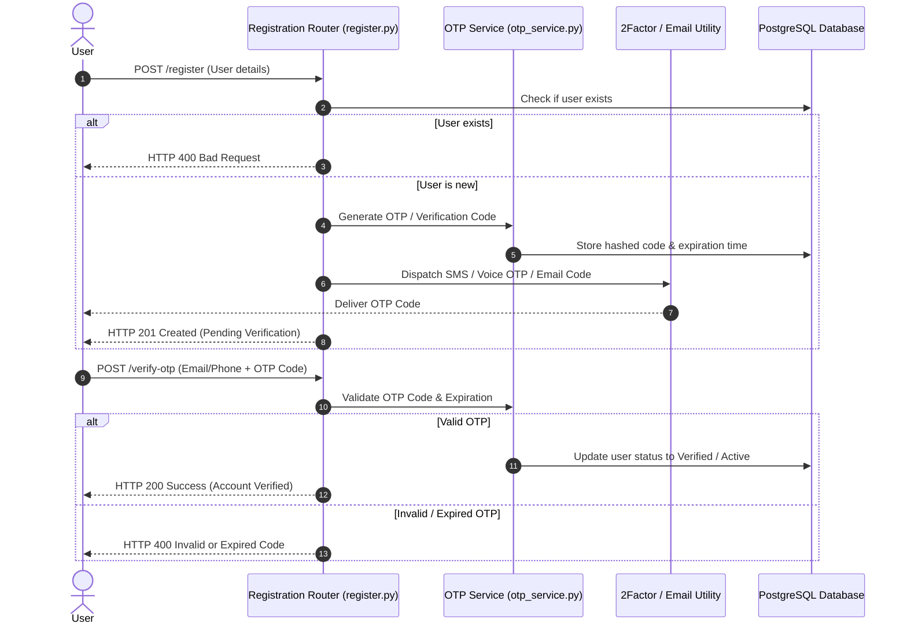
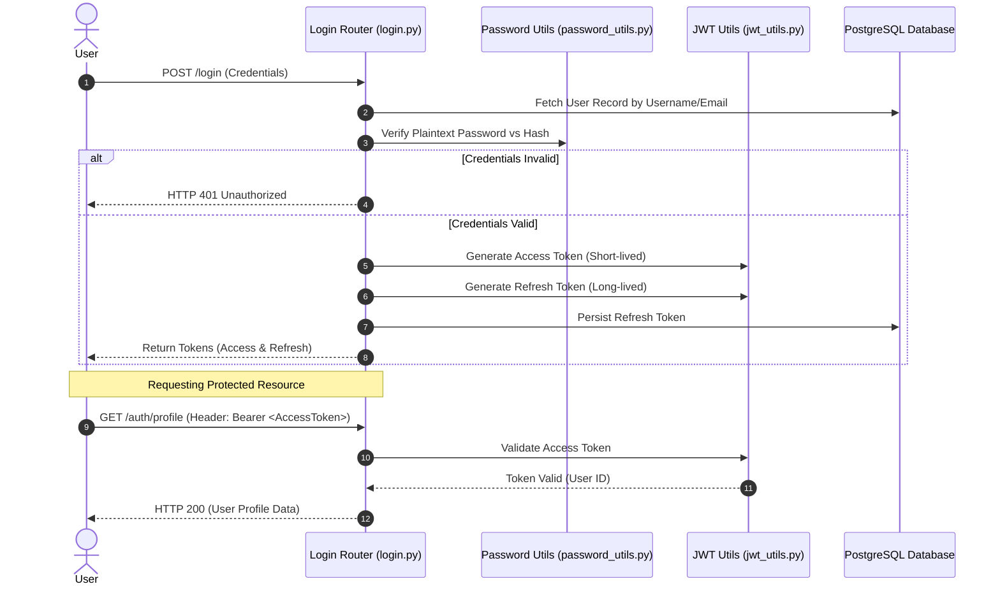
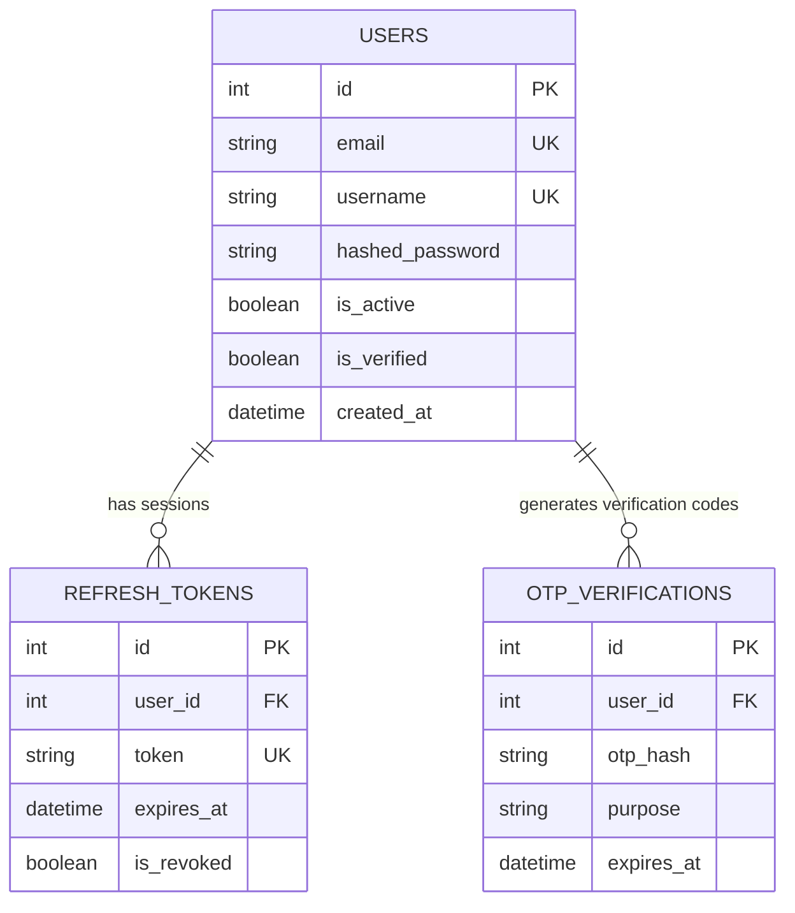

# System Architecture & Design

This document details the architectural design, layer structure, security mechanisms, data flows, and component interactions for the **Authentication API Service**.

---

## 🏗 High-Level Architecture Overview

The application follows a **Modular Layered Architecture** built on FastAPI, SQLAlchemy ORM, and PostgreSQL. It decouples HTTP routing, request validation, business logic, security processing, and database persistence into distinct modules.

---

## 🧩 Layer Breakdown

### 1. **API & Routing Layer** (`main.py`, `*.py` routers)
* **Responsibility**: Exposes HTTP REST endpoints, validates incoming JSON request payloads against Pydantic schemas, handles route dispatching, and formats API responses.
* **Key Components**:
  * `main.py`: Central application entry point, mounts all feature routers and sets up global exception handlers.
  * Routers (`register.py`, `login.py`, `logout.py`, `refresh.py`, `otp_verify.py`, `email_verify.py`, `password_recovery.py`, `change_password.py`).

### 2. **Security & Middleware Layer**
* **Responsibility**: Enforces request rate limits, validates JWT bearer tokens, and handles password hashing & hashing verification.
* **Key Components**:
  * `plimiter.py`: SlowAPI rate limiter instance guarding routes against brute-force attacks.
  * `authenticate.py`: FastAPI dependency (`get_current_user`) extracting and verifying access tokens from HTTP `Authorization` headers.
  * `jwt_utils.py`: Encodes and decodes JWT access tokens and refresh tokens using standard secret key algorithms.
  * `password_utils.py` & `otp_hash_utils.py`: Hashes user passwords and OTP/verification codes securely.

### 3. **Service & Business Logic Layer**
* **Responsibility**: Executes domain logic, coordinates verification token generation, manages token expiration, and invokes third-party integration services.
* **Key Components**:
  * `otp_service.py` & `email_verification_service.py`: Handles OTP generation, code expiration logic, and state validation.
  * `p2factor.py` & `pvoice_otp.py`: External API wrapper for sending SMS and voice-based OTPs via 2Factor provider.
  * `email_utils.py`: SMTP mail sender for delivering account verification and password recovery codes.

### 4. **Persistence & Storage Layer** (`database.py`, `models.py`, `tables.py`)
* **Responsibility**: Manages PostgreSQL connections, database sessions, ORM entity mappings, and database schema definitions.
* **Key Components**:
  * `database.py`: Instantiates SQLAlchemy engine (`create_engine`) and `SessionLocal` factory.
  * `models.py` & `tables.py`: Defines database entities for users, sessions, tokens, and verification codes.

---

## 🔄 Core Data & Execution Flows

### 1. User Registration & OTP Verification Sequence

---

### 2. Login & Token Lifecycle Sequence

---

## 🔒 Security Architecture

1. **Password Hashing**: Passwords are never stored in plaintext. They are hashed using **Argon2** / **Bcrypt** algorithm variants.
2. **Token Security**:
   * **Access Tokens**: Short-lived JWTs containing user identity claims.
   * **Refresh Tokens**: Stored in the database to enable secure session revocation and rotation.
3. **Rate Limiting**: Critical endpoints (`/login`, `/register`, `/verify-otp`, `/password-recovery`) are rate-limited via SlowAPI to mitigate brute-force and credential stuffing attacks.
4. **Environment Isolation**: Database connection strings, SMTP passwords, 2FA API keys, and JWT secrets are injected runtime through `.env` files.

---

## 💾 Database ER Model (Conceptual)

